# glPBRSampleViewer
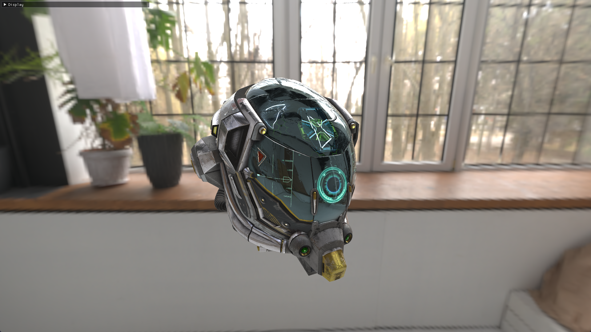

PBR + IBL based gltf viewer in OpenGL 4.6. Also generates Pre filtered enviornment maps for diffuse and specular IBL as well as generates cubemaps for skybox from spherical HDR maps.\
\
Use the **"Display"** drop down menu on the top left corner to view the controls and interact with the application.\
\
You can just directly run the compiled exe by downloading the **glPBRSampleViewer.zip** from the release section if you dont wish to compile. Although if you do please compile it under the x64 Release flag and copy all the contents of the bin folder into the local exe folder.

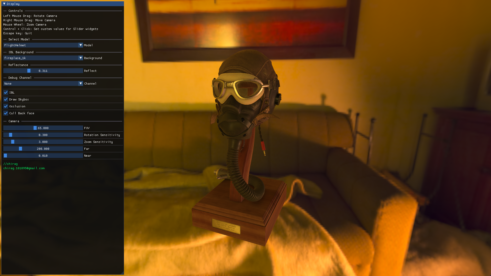

# Rendering Features
* PBR Cook-Torrance Microfacet specular BRDF (Lambertian diffuse BRDF + F(Schlick)* D(GGX) * G(Smith)G1(Schlick_GGX)) 
* Importance sampling and Halton low discrepancy sequence for generating diffuse and specular pre filtered enviornment maps for IBL.\
  [Special thanks to the GSN Composer youtube channel for these PBR and IBL topics](https://www.youtube.com/@gsn-composer).
  
* Direct Drawing with texture arrays (Avoided indirect drawing with glMultiDrawElementsIndirect() since that would require bindless textures and many systems dont support that)
* Alpha blending (Transparent materials are drawn last)
* As well as other minor features such as  gamma correction, spherical to cubemap conversion, and multisampling.

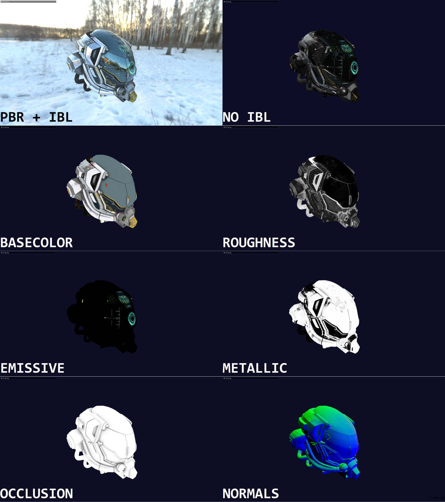

## Application Settings
If you wish to change application settings such as window resolution, enabling fullscreen or enabling multisampling etc., just open the **data.json** file and directly change the first few variable values.\
MSAA samples are set to 8 which can hinder performance on a slow machine, so either disable MSAA or change the "Samples" var in data.json.\
Also, please only use gltf models as well as 1k resolution HDRi maps for consistent performance. If you want to add your own models and HDR maps, just add thier names in the sequence displayed in the **data.json** file.

# More Screenshots
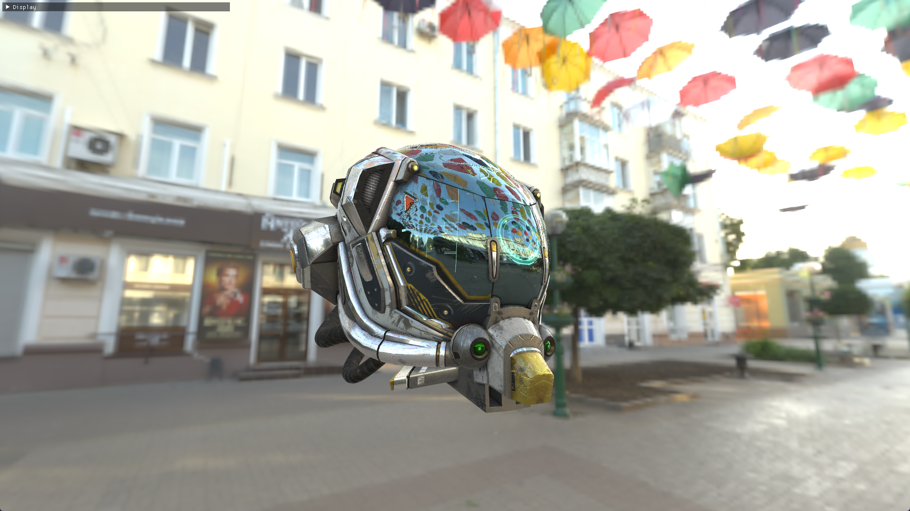
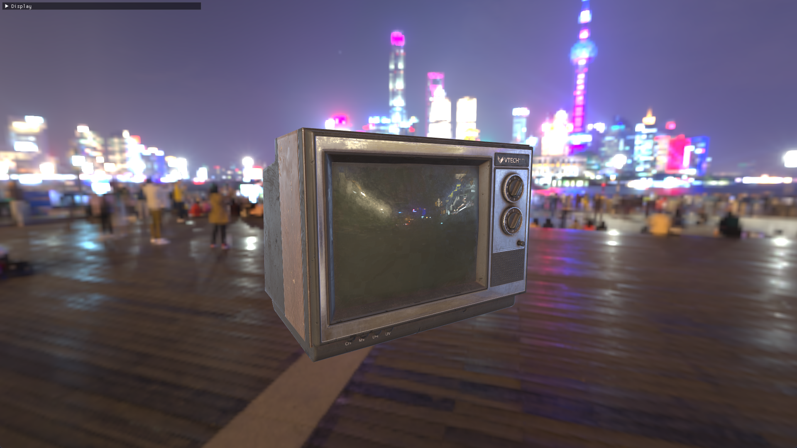
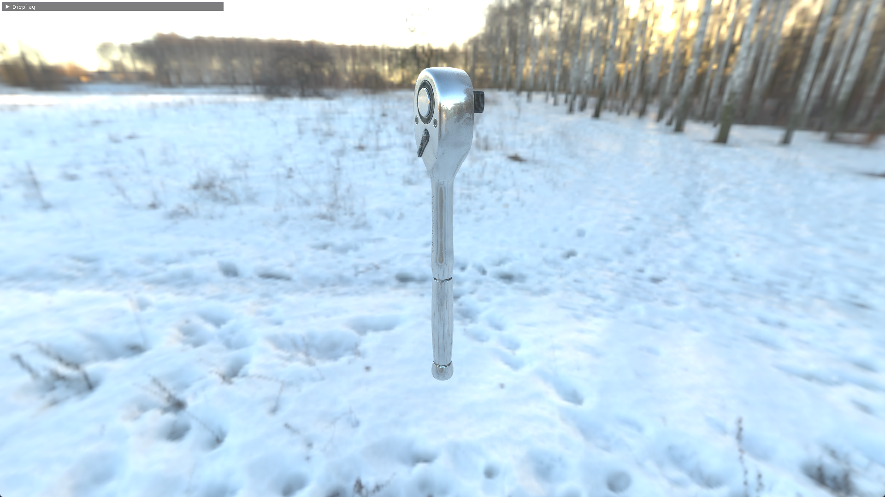
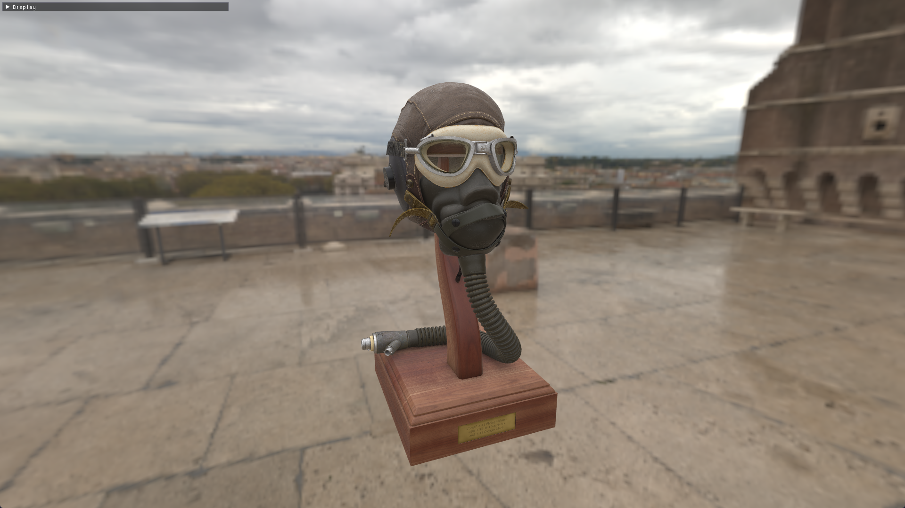
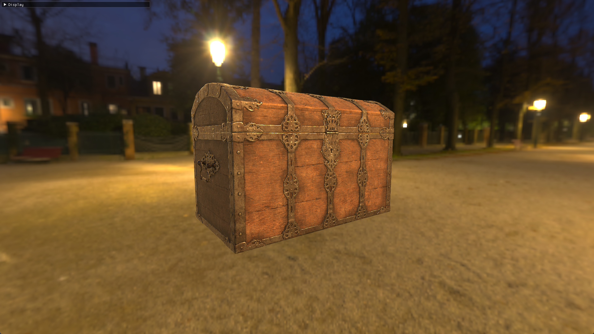
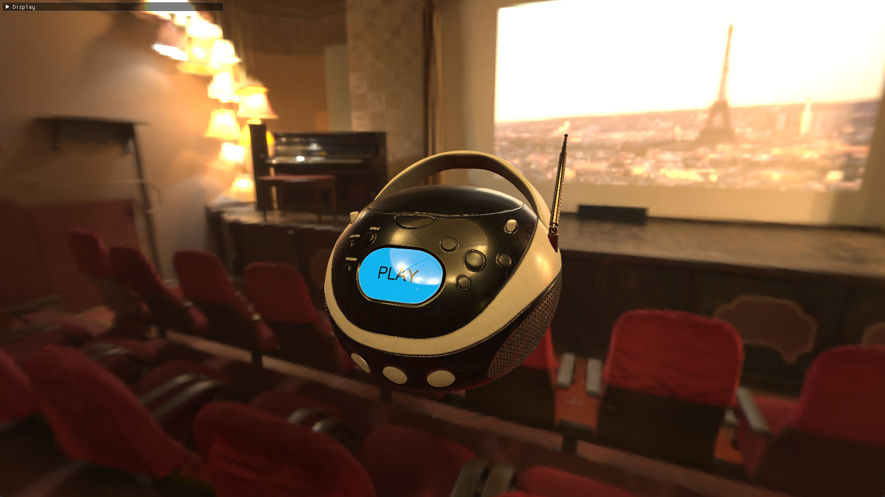
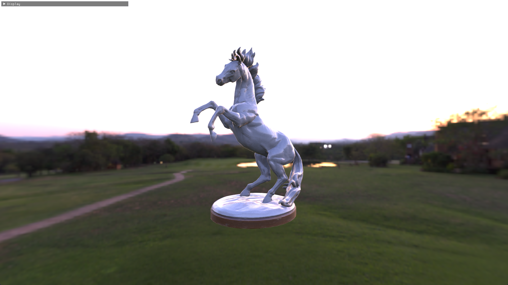
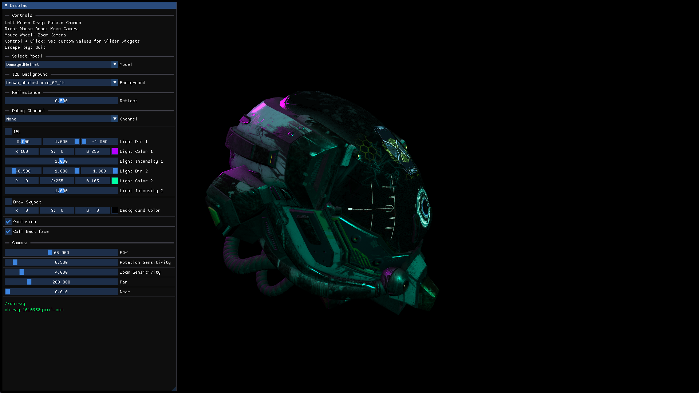

# References
* [GSN Composer Youtube Channel](https://www.youtube.com/@gsn-composer) and thier Shaders Monthly series of videos specifically on the PBR and IBL topics.
* [glTF-Sample-Viewer](https://github.com/KhronosGroup/glTF-Sample-Viewer) for Spherical Map to Cubemap conversion shader fundamentals.
* [KhronosGroup/glTF-Sample-Models](https://github.com/KhronosGroup/glTF-Sample-Models) and [Poly Haven](https://polyhaven.com/) for the GLTF models and HDR maps.
* Also **Libraries** used Assimp, glm, glew, imgui, JSON, spdlog, stb_image, SDL2.
